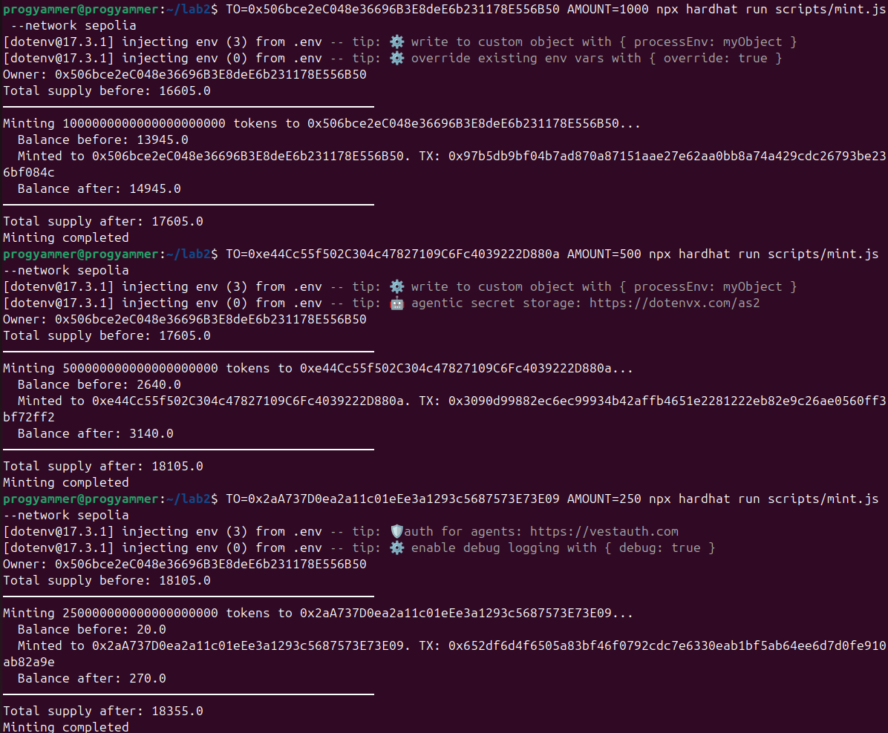
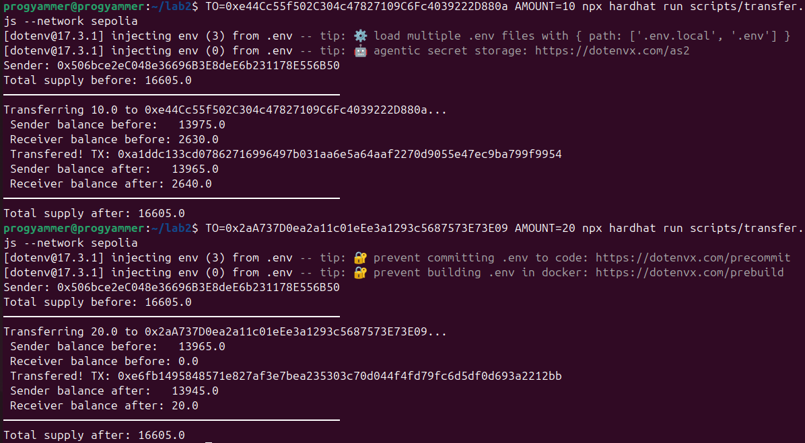
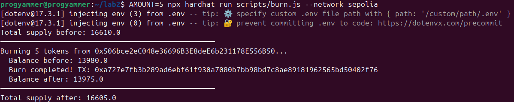

# Лабораторная работа №2: Разработка и развертывание токена в тестовой сети

Группа:
* Misha:     0x506bce2eC048e36696B3E8deE6b231178E556B50
* Nazarchik: 0xe44Cc55f502C304c47827109C6Fc4039222D880a
* Katya:     0x2aA737D0ea2a11c01eEe3a1293c5687573E73E09

Тестовая сеть: Sepolia (Ethereum)

Адрес контракта: [0x32F86B797D52bf45f1561bbf9A548745BED55DB7](https://sepolia.etherscan.io/address/0x32F86B797D52bf45f1561bbf9A548745BED55DB7)

## Создание кошелька и получение тестовых средств

С помощью браузерного расширения `MetaMask` создали новый кошелёк. Выбрали сеть Sepolia, и с помощью *Google Cloud Web3 Faucet* добавили токенов

## Подготовка среды разработки

Для разработки смарт-контракта будет использоваться фреймворк `Hardhat`

### Установка зависимостей

```bash
npm init -y
npm install --save-dev hardhat @nomicfoundation/hardhat-toolbox @openzeppelin/contracts dotenv
```

### Инициализация проекта

```bash
npx hardhat init
```

### Конфигурация сети

Расширили [hardhat.config.js](./hardhat.config.js):

```javascript
  networks: {
    sepolia: {
      url: process.env.SEPOLIA_RPC_URL,
      accounts: [process.env.SEPOLIA_PRIVATE_KEY],
    },
  },
  etherscan: {
    apiKey: process.env.ETHERSCAN_API_KEY,
  }
```

В `.env` указали все параметры:

```env
SEPOLIA_RPC_URL=https://ethereum-sepolia-rpc.publicnode.com
SEPOLIA_PRIVATE_KEY=...
ETHERSCAN_API_KEY=...
```

## Создание смарт-контракта

Разработали токен стандарта **ERC-20** с использованием библиотеки `OpenZeppelin`:

- Контракт наследует `ERC20` (стандартный токен) и `Ownable` (управление владельцем)
- Владелец контракта устанавливается при развертывании (`msg.sender`)
- Функция `mint` доступна только владельцу (модификатор `onlyOwner`)
- Функция `burn` позволяет любому держателю сжечь свои токены

### Компиляция контракта

```bash
npx hardhat compile
```

## Развертывание контракта в тестовой сети Sepolia

Для развертывания создали скрипт [scripts/deploy.js](./scripts/deploy.js)

```bash
npx hardhat run scripts/deploy.js --network sepolia
```

### Результат

Контракт был развернут по адресу: `0x32F86B797D52bf45f1561bbf9A548745BED55DB7`

## Верификация контракта на Etherscan

Для публичного доступа к исходному коду выполнили верификацию:

```bash
npx hardhat verify --network sepolia 0x32F86B797D52bf45f1561bbf9A548745BED55DB7
```
### Результат

Контракт успешно верифицирован:  
[https://sepolia.etherscan.io/address/0x32F86B797D52bf45f1561bbf9A548745BED55DB7#code](https://sepolia.etherscan.io/address/0x32F86B797D52bf45f1561bbf9A548745BED55DB7#code)

## Эмиссия токенов (Mint)

Для выпуска токенов участникам создали скрипт [scripts/mint.js](./scripts/mint.js)

```bash
TO=0x506bce2eC048e36696B3E8deE6b231178E556B50 AMOUNT=1000 npx hardhat run scripts/mint.js --network sepolia
TO=0xe44Cc55f502C304c47827109C6Fc4039222D880a AMOUNT=500 npx hardhat run scripts/mint.js --network sepolia
TO=0x2aA737D0ea2a11c01eEe3a1293c5687573E73E09 AMOUNT=250 npx hardhat run scripts/mint.js --network sepolia
```

### Результат

* Misha: +1000 MTK
* Nazarchik: +500 MTK
* Katua: +250 MTK



## Перевод токенов

Для выполения функции `transfer` создали скрипт [scripts/transfer.js](./scripts/transfer.js)

```bash
TO=0xe44Cc55f502C304c47827109C6Fc4039222D880a AMOUNT=10 npx hardhat run scripts/transfer.js --network sepolia
TO=0x2aA737D0ea2a11c01eEe3a1293c5687573E73E09 AMOUNT=20 npx hardhat run scripts/transfer.js --network sepolia
```

### Результат

Успешно переведено *10 MTK* от Misha к Nazarchik
Успешно переведено *20 MTK* от Misha к Katya



## Сжигание токенов (Burn)

Для выполения `burn` создали скрипт [scripts/burn.js](./scripts/burn.js)

```bash
AMOUNT=5 npx hardhat run scripts/burn.js --network sepolia
```

### Результат

Успешно сожжено *5 MTK*


